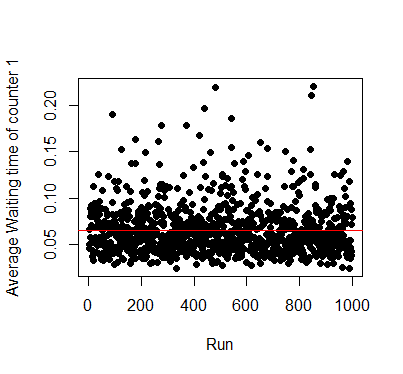
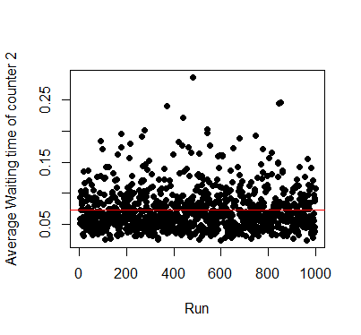
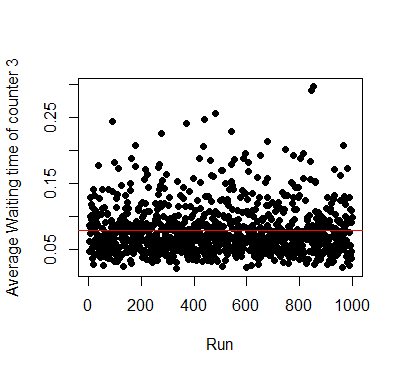
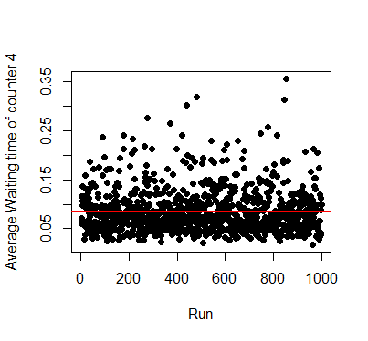
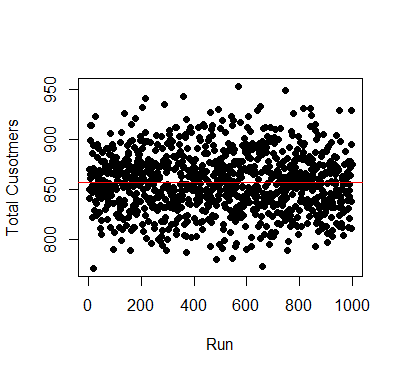

Supermarket Simulation Project Report
================
Kalana Ekanayake

# Introduction

This project involves designing a **Discrete Event Simulation** model to
simulate the operations of a supermarket with multiple checkout counters
and evaluating performance of the system.

- The Supermarket consists of 4 parallel checkout counters each with a
  dedicated cashier whose service time follows an **Exponential
  Distribution** with rates 1/2.5, 1/3, 1/3.5, 1/4.

- Customers Arrive according to a **Poisson Process** with $\lambda$ =
  72(customers per hour) and spends time shopping which follows a **Log
  Normal Distribution** with log($\mu$) = 0 and log($\sigma$) = 0.5

- After shopping the customer joins the counter with the smallest queue.

- The supermarket opens at 8:00 am and closes at 9:00 pm. Customers
  cannot enter the supermarket after 9:00 pm, But the customers who
  already entered the supermarket will continue to shop and checkout.

The primary objective of this simulation is to estimate,

- Average waiting times at each checkout counter

- Average total time customers spend in the supermarket (shopping and
  checkout)

- Cashier utilization rates

- Total number of customers served per day

By Analyzing these we can determine if the current checkout system at
the supermarket is efficient or if any adjustment is needed.

# Methodology

## System State Variables

- N = Number of customers in the Shop at time t

## Time Variables

- t = Elapsed time
- t_A = Arrival time of the next customer
- t_S = Shopping finish time of the next customer
- t_D = Departure time of the next customer
- t_D_1 = Departure time of the next customer from counter 1
- t_D_2 = Departure time of the next customer from counter 2
- t_D_3 = Departure time of the next customer from counter 3
- t_D_4 = Departure time of the next customer from counter 4
- t_C_1 = Total busy time of counter 1
- t_C_2 = Total busy time of couter 2
- t_C_3 = Total busy time of counter 3
- t_C_4 = Total busy time of counter 4

## Counter Variables

- nc1 = Number of customers at counter 1
- nc2 = Number of customers at counter 2
- nc3 = Number of customers at counter 3
- nc4 = Number of customers at counter 4
- N_S = Number of customers shopping at time t

## Event List

- Customer arriving at the shop
- Customer finish shopping and joins a queue
- Customer departs from the shop

## Algorithm

**Initialize all the variables**

- Set t to 8:00 am
- Set t_A to first arrival time.
- Set t_S to first arrival time + shopping time
- Set t_D and counter departure times (t_D_1,…,t_D,4) to Infinity
- Set customer_id, N, N_S and customer count at queues (nc1,…,nc2) to 0
- Create empty data frame to store customer id, arrival time, shopping
  finish time, service finish time and departure finish time.
- Create vectors to store the relevant times for each queue

**Event Processing**

The simulation runs until the supermarket closes and there are no
customers in the supermarket.

If the next time stamp is a customer arrival (minimum of t_A, t_S and
t_D),

- N is incremented by 1
- t is set to t_A
- N_S is incremented by 1
- t_S is updated with the next shopping finish time
- The customer id is added to vector along with there shopping finish
  time
- Add the customer id, arrival time and shopping finish time to data
  frame.

If the next time stamp is for a customer finishing shopping (minimum of
t_A, t_S and t_D),

- choose the counter with the shortest queue.
- Increment the counter variable for the queue by 1 (nc1,…,nc4)
- Add the service start time to the data frame
- generate service time, then calculate and assign the next departure
  time for the current queue(t_D_1,…,t_D_4)
- Remove the minimum time and the corresponding customer id from the
  shopping finish time vector.

If the next time stamp is for a customer departing a queue (minimum of
t_A, t_S and t_D),

- Find the counter which the departure happens (minimum of
  t_D_1,…,t_D_4)
- decrease the counter variable for the relevant counter by 1
  (nc1,…,nc4)
- Generate next departure time for the relevant counter if there are
  customers at the counter, if not set it to Infinity.
- The departure time and the relevant customer id is added to a vector

For each iteration of the loop the t_D variable is set to minimum of
t_D_1,…,t_D_4 and each time the generated service time is added to the
busy time of the particular counter(t_C_1,…, t_C_4)

Finally all the are data collected from the vectors and data frames are
merged together using the customer ids. Then the necessary metrics are
calculated from the collected data.

**Assumptions**

- Infinite queue capacity.
- Customers must and will only join one queue and will not change the
  queue.
- Customer will choose the shortest queue to join.

# Results

The results obtained after 1000 runs of the simulation is given below,

- Average waiting time for counter 1 = 3.90 minutes

- Average waiting time for counter 2 = 4.37 minutes

- Average waiting time for counter 3 = 4.77 minutes

- Average waiting time for counter 4 = 5.17 minutes

- Average time spent shopping in the supermarket = 5.17 minutes

- Average utilization of counter 1 = 39.02 %

- Average utilization of counter 2 = 35.77 %

- Average utilization of counter 3 = 32.54 %

- Average utilization of counter 4 = 29.58 %

Equation for utilization of a counter calculation,

$$\text{Utilization of counter } i = \frac{\text{Busy time of counter }i}{\text{Total time}}$$

# Conclusion

From the Above Results we can conclude that under the given parameters
the checkout process of the supermarket is very efficient but the
cashiers are idle for the majority of the time.

1.  Lower times spent at checkout queues
    - counter 1 (fastest): 3.90 minutes
    - counter 4 (slowest): 5.17 minutes
    - From total time spent in the supermarket customers spend about 34%
      is spent at the checkout
2.  Unbalanced counter utilization
    - counter 1: 39.02 %
    - counter 4: 29.58 %
    - Relatively faster counters are utilized more than slower counters

With the lower waiting times and the higher idle times the next step of
this project would be to simulate the supermarket while closing the
counter 4 entirely to see the effect and see if it makes the entire
process much efficient.
